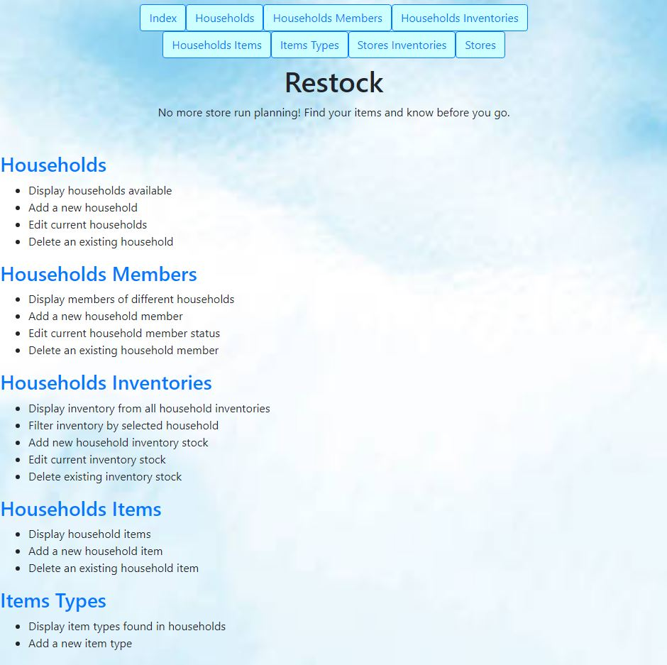
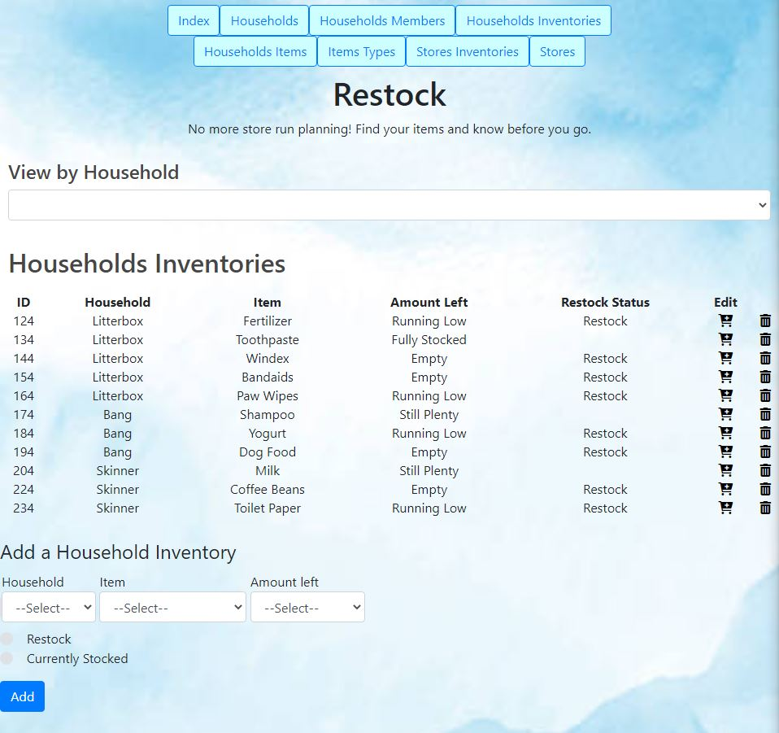

# Project Restock.py

Project Restock is a Flask/MySQL web app designed for an administrator to handle restocking needs of various households.

**Heroku link upon request.**

## User Stories

The following functionality is **completed**:

- [x] User can view, create, edit, and delete households
- [x] User can view, create, edit, and delete household members
- [x] User can view, create, edit, and delete household inventories
- [x] User can filter household inventories by household
- [x] User can view, create, and delete household items
- [x] User can view and add a new item type
- [x] User can view and add a new store inventory item
- [x] User can view, create, edit, and delete stores

## Other features include:
- [x] A home page.
- [x] When editing/deleting an entity, referential integrity is maintained
        For example, a household name has been changed so this is updated in the members and inventories tables as well.
- [x] J2 templates and CSS added.
- [x] Heroku deployment.

## Screenshots

